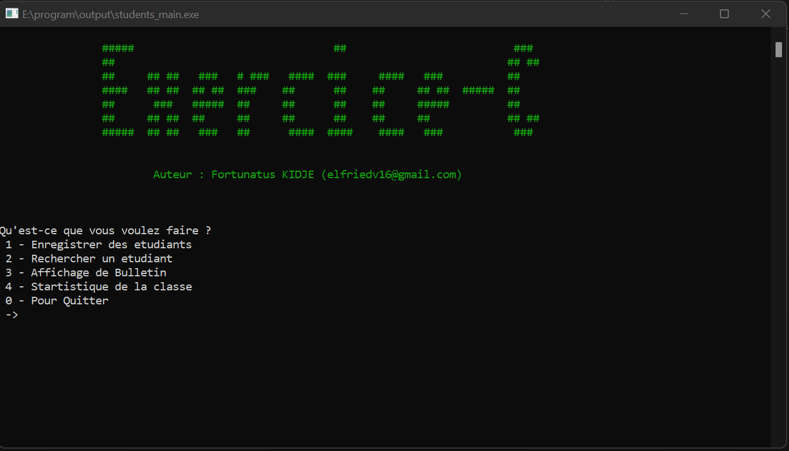

# Students Manager Program built with C (HomeWork)

Ce programme est une application de gestion des étudiants, il permet de sauvegarder les informations sur les étudiants, rechercher les informations sur un étudiant, afficher la liste de tous les étudiants et afficher les statistiques sur les étudiants enregistrés. Le programme a été écrit par Elfried Fortunatus KIDJE et est sous licence MIT.

## Comment utiliser le programme
Le programme est exécuté à partir de la ligne de commande. Il utilise un menu interactif pour permettre à l'utilisateur de sélectionner l'opération à effectuer. Le menu propose les options suivantes :

    1 - Sauvegarder les informations sur les étudiants
    2 - Rechercher les informations sur un étudiant
    3 - Afficher la liste de tous les étudiants
    4 - Afficher les statistiques sur les étudiants enregistrés
    0 - Quitter le programme
L'utilisateur doit entrer le numéro de l'option souhaitée dans la console pour effectuer l'opération correspondante. 

## Configuration requise
Le programme nécessite une installation du compilateur C pour fonctionner. Il utilise également des fichiers d'en-tête et des fichiers de fonctions définis dans le dossier "cores" à savoir :

    1 - students_declaration.h : Qui contient les la déclaration des variables et constantes. Ainsi que la définition de tous les fonctions.
    2 - students_functions.c : Qui contient les fonctions nécessaire pour le bon fonctionnement du programme.
    3 - students_helpers.c : Qui contient quelques fonctions d'aide supplémentaires (couleurs, symboles, ...).     

## Licence
Le programme est sous licence MIT, ce qui signifie que les utilisateurs ont le droit de l'utiliser, de le modifier et de le distribuer à condition de conserver la mention de l'auteur et de la licence.

## Source & Documentation
Le code source du programme et la documentation sont disponibles sur GitHub à l'adresse suivante : https://github.com/v1p3r75/students_manager

